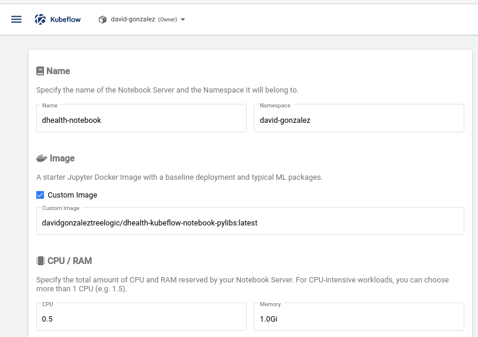
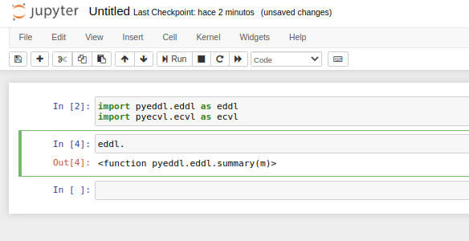

# Kubeflow Pipeline

We tested the use case from ECVL libraries in the Kubeflow Pipeline. The goal is to launch in a distributed/parallel way the inference.

After defining the pipeline in Python as described above, you must compile the pipeline to an intermediate representation before you can submit it to the Kubeflow Pipelines service. 

```bash
$ dsl-compile --py [path/to/python/file.py] --output [path/to/output/file.yaml]
```

# Kubeflow Notebook

Deploy a notebook with the custom image, it must first be adapted and uploaded to [DockerHUB](https://hub.docker.com/repository/docker/davidgonzaleztreelogic/dhealth-kubeflow-notebook-pylibs). The use case used is the one that has been previously worked on and appears in the project's GitHub repository. This adaptation will allow it to be used in Jupyter Notebook without any problem. The Dockerfile is the following:

```bash
ARG BASE_IMAGE=dhealth/pylibs:latest
 
 
FROM ${BASE_IMAGE}
 
USER root
 
ENV NB_USER jovyan
ENV NB_UID 1000
ENV HOME /home/$NB_USER
 
RUN useradd -M -s /bin/bash -N -u $NB_UID $NB_USER && \
    chown -R ${NB_USER}:users /usr/local/bin && \
    mkdir -p $HOME
 
RUN chown -R ${NB_USER}:users $HOME
 
RUN pip3 install jupyter
 
# Install Tini - used as entrypoint for container
RUN cd /tmp && \
    wget --quiet https://github.com/krallin/tini/releases/download/v0.18.0/tini && \
    echo "12d20136605531b09a2c2dac02ccee85e1b874eb322ef6baf7561cd93f93c855 *tini" | sha256sum -c - && \
    mv tini /usr/local/bin/tini && \
    chmod +x /usr/local/bin/tini
 
# Configure container startup
EXPOSE 8888
USER jovyan
CMD ["sh","-c", "jupyter notebook --notebook-dir=/home/jovyan --ip=0.0.0.0 --no-browser --allow-root --port=8888 --NotebookApp.token='' --NotebookApp.password='' --NotebookApp.allow_origin='*' --NotebookApp.base_url=${NB_PREFIX}"]
```

As seen here, the base of the container is dhealth/pylibs:latest. Tini is installed and will serve as the container's entrypoint and will be exposed on port 8888. The Pylibs image adaptation is in the davidgonzaleztreelogic/dhealth-kubeflow-notebook-pylibs repository for testing.

Once the image is adapted, it is loaded into the Notebook creation using the Custom image option.



Once created, you can see how it is possible to use the libraries on the notebook:


